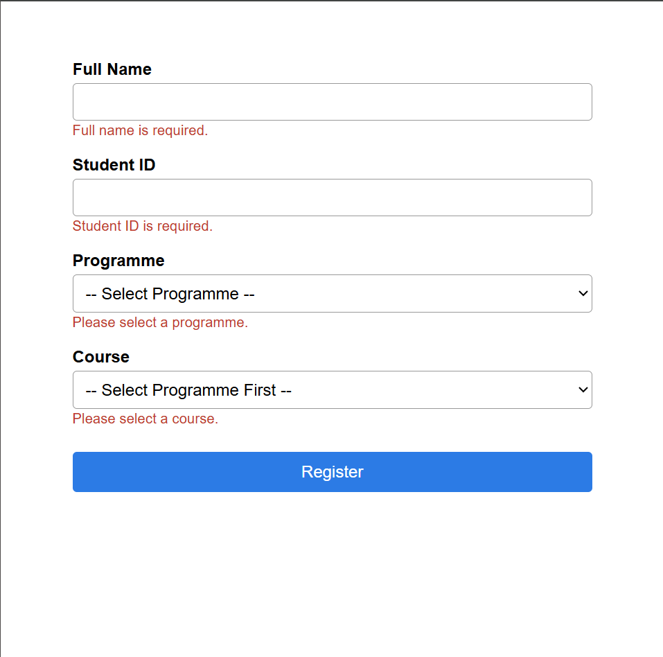
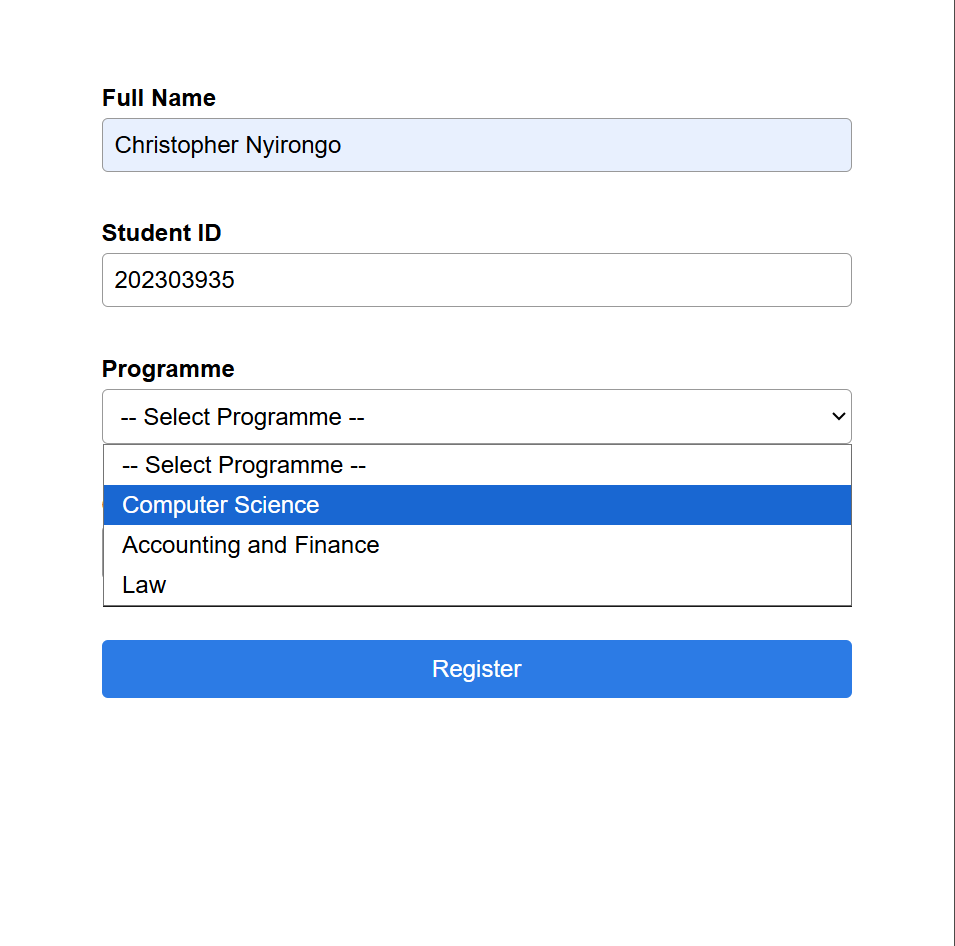
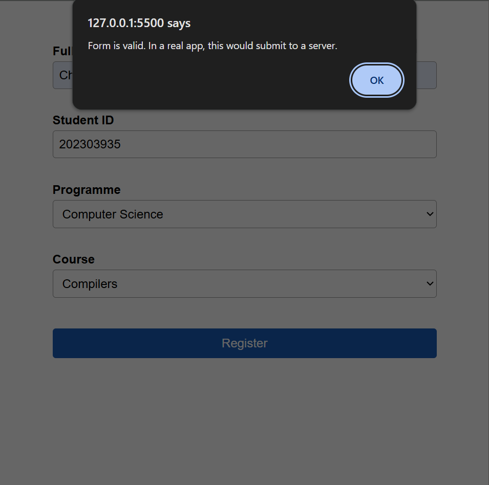

# Demo Notes

## 1. Empty form validation

Submitting the form with every field empty triggers a distinct error
message under each field ("Full name is required.", "Student ID is
required.", "Please select a programme.", "Please select a course."),
confirming the required-field validation runs on submit.

## 2. Programme → Course dependency

With Full Name and Student ID filled in, opening the Programme dropdown
shows the three available programmes (Computer Science, Accounting and
Finance, Law). Selecting "Computer Science" here populates the Course
dropdown with only the courses that belong to it.

## 3. Successful submission

With all fields filled in correctly (a valid 9-digit Student ID, a
Programme, and a matching Course), submitting the form passes all
validation checks and shows a success alert, confirming the happy path
works end-to-end on the client side.